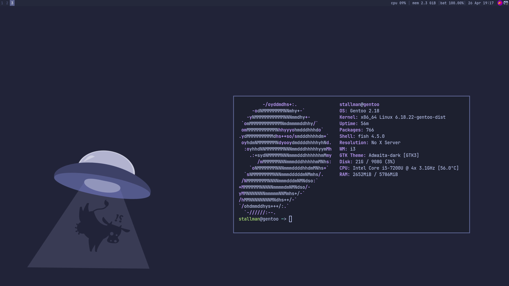

<h1 align="center">I3-WM Dotfiles ! :3</h1>



Minimalist i3wm configuration in blue and purple tones.

## Configuration Paths
- **Terminal:** `~/.config/alacritty/alacritty.toml`
- **Window Manager:** `~/.config/i3/config`
- **Status Bar:** `/etc/i3status.conf`
- **Wallpaper:** `~/wallp.png`
- **Flameshot:** `~/.config/flameshot/flameshot.ini`

## Dependencies

### Gentoo
```bash
emerge x11-wm/i3 \
       x11-misc/i3status \
       x11-terms/alacritty \
       x11-misc/dmenu \
       media-fonts/jetbrains-mono \
       media-gfx/feh \
       x11-misc/xclip \
       x11-misc/autotiling
```

**Sway Extras (Gentoo):**
```bash
emerge gui-wm/sway \
       gui-apps/awww \
       gui-apps/flameshot \
       gui-apps/grim \
       gui-apps/wl-clipboard \
       x11-base/xwayland
```

### Arch
```bash
pacman -S i3-wm \
          i3status \
          alacritty \
          dmenu \
          ttf-jetbrains-mono \
          feh \
          xclip \
          autotiling
```

**Sway Extras (Arch):**
```bash
pacman -S sway \
          awww \
          flameshot \
          grim \
          wl-clipboard \
          xorg-xwayland
```

### Void
```bash
xbps-install i3 \
             i3status \
             alacritty \
             dmenu \
             font-jetbrains-mono-otf \
             feh \
             xclip \
             autotiling
```

**Sway Extras (Void):**
```bash
xbps-install sway \
             swww \
             flameshot \
             grim \
             wl-clipboard \
             xwayland
```

### Mint | Ubuntu
```bash
apt install i3 \
            i3status \
            alacritty \
            dmenu \
            fonts-jetbrains-mono \
            feh \
            xclip \
```

**Sway Extras ( Mint | Ubuntu):**
```bash
apt install sway \
            flameshot \
            grim \
            wl-clipboard \
            xwayland
```
---
